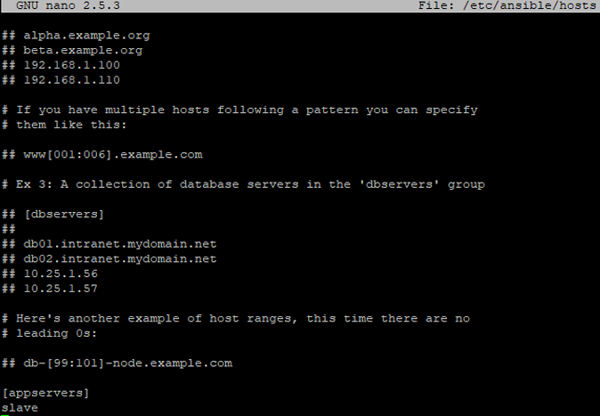

# Installation Notes

## Connecting to EC2 instance (Ubuntu)
- **Setting up SSH**

Please follow the below steps to solve the ssh problem:  
  - At first, you need to transfer your AWS EC2 instance .pem file from your local to AWS EC2 instance using Filezilla software.  

**Please follow the steps as given in the below video which will help you to transfer files from your local windows system to AWS EC2 instance:**
[Youtube link](https://www.youtube.com/watch?v=Qxs7CYguo70)

Note:
The ```.pem``` is a private key file which you will get while creating the instance.
  - After that follow the steps given below for getting the passwordless ssh connection in between two EC2 instances.
    ```shell
      su - ubuntu
      sudo service ufw stop
      sudo service ssh start
      eval `ssh-agent -s`
      chmod 400 file_name.pem
      ssh-add file_name.pem
      ssh ubuntu@<private_IP_of_the_other_instance>
    ```

## Installing Ansible
- **Before installing Ansible package add Ansible repository to your system**

    ```shell
      sudo apt-add-repository ppa:ansible/ansible
    ```

- **Run the update command before installing to update existing packages**

    ```shell
      sudo apt-get update
    ```

- **Now install the Ansible package**

    ```shell
      sudo apt-get install ansible
    ```

- **You can check if you're on the latest version of Ansible by running the version command**

    ```shell
      ansible --version
    ```

## Setting up hosts
- **To set up hosts you need to edit the hosts file in the Ansible directory**

    ```shell
      sudo nano /etc/ansible/hosts
    ```

  

- Change your directory to ```/etc/ansible``` 

  ```shell
    cd /etc/ansible
  ```

- Now you can check if Ansible's connections with your hosts in your inventory file is good

  Use the Ansible's ping module to check whether or not Ansible is connecting to hosts

    ```shell
      ansible -m ping <hosts>
    ```
