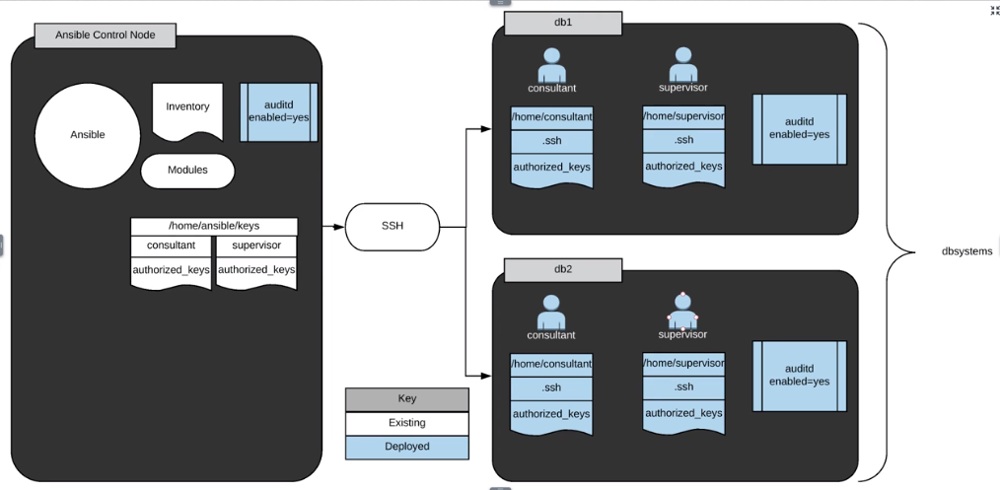

# Learn Ansible by Doing
- **[Installation and Configuration](#installation-and-configuration-1)**
    - [Deploying Ansible](#deploying-ansible)
    - [Getting Started with Ansible](#getting-started-with-ansible)
    - [Ad-Hoc Ansible Commands](#ad-hoc-ansible-commands)
    - [Working with Ansible Inventories](#working-with-ansible-inventories)
- **[Plays and Playbooks](#plays-and-playbooks-1)**
    - [Ansible Playbooks: The Basics](#ansible-playbooks-the-basics)
    - [Ansible Playbooks - Error Handling](#ansible-playbooks---error-handling)
    - [Working with Ansible Templates, Variables, and Facts](#working-with-ansible-templates-variables-and-facts)
    - [Writing Your First Ansible Playbook](#writing-your-first-ansible-playbook)
    - [Deploying Services Using Ansible](#deploying-services-using-ansible)
    - [Advanced Features in Ansible Playbooks](#advanced-features-in-ansible-playbooks)
- **[Roles](#roles-1)**
    - [Working with Ansible Roles](#working-with-ansible-roles)
- **[Working With Files](#working-with-files-1)**
    - [File Manipulation with Ansible](#file-manipulation-with-ansible)
- **[Ansible Vault](#ansible-vault-1)**
    - [Working with Confidential Data in Ansible](#working-with-confidential-data-in-ansible)


<br><br><br><br>
## Installation and Configuration
### Deploying Ansible

- Install Ansible on the control host.
    Run the following commands on the control host:
    ```shell
    sudo yum install epel-release
    sudo yum install ansible
    ```
- Create an `ansible` user on both the control host and workstation host being sure to set a password you can remember.
    On each host, run the noted commands below. Make sure you set a password you can remember (you will need it later).

    Assuming you are logged in as cloud_user:
    ```shell
    sudo useradd ansible
    sudo passwd ansible
    ```
- Configure a pre-shared key for Ansible that allows the user to log in from `control` to `workstation` without a password.
    Assuming you are logged into control as **cloud_user**, run the following commands providing the appropirate passwords when prompted and default options otherwise:
    ```bash
    sudo -i -u ansible # (provide cloud_user a sudo password)
    ssh-keygen # (accept default options by pressing enter)
    ssh-copy-id workstation # (provide ansible user a password)
    logout
    ```
- Configure the Ansible user on the workstation host so that Ansible may sudo without a password.
    Log into the workstation host as cloud_user and run the following commands:
    ```bash
    sudo visudo
    # Add text at the end of the file that is opened:
    ansible ALL=(ALL) NOPASSWD: ALL
    # Save file:
    # (:wq in vim)
    ```

- Create a simple inventory in `/home/ansible/inventory` consisting of only the `workstation` host.

    On the control host as the ansible user run the following commands:
    ```bash
    vim /home/ansible/inventory
    ```
    (note: you may use any text editor with which you are comfortable)
    Add the text "workstation" to the file and save using (`:wq in vim`).

- Write an Ansible playbook in `/home/ansible/git-setup.yml` on the control node that installs `git` on `workstation` then execute the playbook.
    On the control host as the ansible user run the following commands:
    ```bash
    vim /home/ansible/git-setup.yml # (You may use any text editor with which your are comfortable.)
    ```
    Add the following text to the file:
    ```yaml
    --- # install git on target host
    - hosts: workstation
      become: yes
      tasks:
      - name: install git
        yum:
          name: git
          state: latest
    ```
    Save (:wq in vim) and quit the text editor.

    **Run** 
    ```
    ansible-playbook -i /home/ansible/inventory /home/ansible/git-setup.yml
    ```


<br><br><br><br>
### Getting Started with Ansible
-  Install Ansible on the control node.
    To install Ansible on the control node, run 
    ```bash
    sudo yum install ansible
    ```

- Configure the `ansible` user on the control node for ssh shared key access to managed nodes. Do not use a passphrase for the key pair.
    - To create a keypair for the ansible user on the control host, run the following: ```sudo su - ansible```
    - ```ssh-keygen``` (accept all defaults: press enter for each prompt)
    - Copy the public key to both **node1** and **node2**.
    - As the `ansible` user on the control host:
        - `ssh-copy-id node1` (accept the host key if prompted, authenticate as ansible user)
        - `ssh-copy-id node2` (accept the host key if prompted, authenticate as ansible user)

- Create a simple Ansible inventory on the control node in `/home/ansible/inventory` containing `node1` and `node2`.
    - On the control host:
    - `sudo su - ansible` (if not already ansible user)
    - `touch /home/ansible/inventory`
    - `echo "node1" >> /home/ansible/inventory`
    - `echo "node2" >> /home/ansible/inventory`

- Configure sudo access for Ansible on `node1` and `node2` such that Ansible may use sudo for any command with no password prompt.
    - Log in to node1 as cloud_user and edit the sudoers file to contain appropriate access for the ansible user:
        - `ssh cloud_user@node1`
        - `sudo visudo`
        - Add the following line to the file and save:
            ```yaml
            ansible    ALL=(ALL)       NOPASSWD: ALL
            ```
        - Repeate these steps for node2.

- Verify each managed node is able to be accessed by Ansible from the control node using the `ping` module. Redirect the output of a successful command to `/home/ansible/output`.
    - To verify each node, run the following as the ansible user from the control host:
        - `ansible -i /home/ansible/inventory node1 -m ping`
        - `ansible -i /home/ansible/inventory node2 -m ping`

    - To redirect output of a successful command to /home/ansible/output:
        - `ansible -i /home/ansible/inventory node1 -m ping > /home/ansible/output`


<br><br><br><br>
### Ad-Hoc Ansible Commands

To summarize, you must do the following:
- Create the user accounts noted in /home/ansible/userlist.txt.
- Copy the authorized_keys file for each user to the correct location so the new accounts can log in with ssh key authentication.
- Ensure auditd is enabled and running on all systems.





<br><br><br>
- Create the User Accounts Noted in `/home/ansible/userlist.txt`

    ```bash
    ansible dbsystems -b -m user -a "name=consultant"
    ansible dbsystems -b -m user -a "name=supervisor"
    ```

    > `-b` - become
    > `-m` - module
    > `user` -
    > `-a` -

- Place Key Files in the Correct Location, `/home/$USER/.ssh/authorized_keys`, on Hosts in `dbsystems`
    
    - Create directory and add permissions

        ```bash
        ansible dbsystems -b -m file -a "path=/home/consultant/.ssh state=directory owner=consultant group=consultant mode=0755"
        ```
    - 
        ```bash
        ansible dbsystems -b -m copy -a "src=/home/ansible/keys/consultant/authorized_keys dest=/home/consultant/.ssh/authorized_keys mode=0600 owner=consultant group=consultant"
        ```
    - Create directory and add permissions

        ```bash
        ansible dbsystems -b -m file -a "path=/home/supervisor/.ssh state=directory owner=supervisor group=supervisor mode=0755"
        ```

    - 
        ```bash
        ansible dbsystems -b -m copy -a "src=/home/ansible/keys/supervisor/authorized_keys dest=/home/supervisor/.ssh/authorized_keys mode=0600 owner=supervisor group=supervisor"
        ```

- Ensure `auditd` Is Enabled and Running on All Hosts
    ```bash
    ansible all -b -m service -a "name=auditd state=started enabled=yes"
    ```


<br><br><br><br>
### Working with Ansible Inventories

Ansible relies on an inventory for base functionality. While inventories can be very simple, they have been designed to be robust. This exercise walks through how to use some of the more advanced features available within an Ansible inventory. Upon completion of this exercise, students will have practical experience with Ansible inventory configuration.

This course is not approved or sponsored by Red Hat.

#### Additional Resources

Your company decided that their backup software license was frivolous and unnecessary. Because of this, the license was not renewed. As a stopgap measure, your supervisor has created a simple script and an Ansible playbook to create an archive of select files, depending on pre-defined Ansible host groups. You will create the inventory file to complete the backup strategy.

Important notes:
- For your convenience, Ansible has been installed on the control node.
- The user ansible has already been created on all servers with appropriate shared keys for access to managed servers from the control node.
- The ansible user has the same `password` as `cloud_user`.
- `/etc/hosts` entries have been made on `control1` for the managed servers.

<br><br>
**Learning objectives:**

- Create the inventory File in `/home/ansible/`
  - Create the `inventory` file in `/home/ansible/`
    `touch /home/cloud_user/.ansible/inventory`
- Configure the media Host Group to Contain `media1` and `media2`
  - Use an editor, such as **Vim**, to configure the `media` host group to contain `media1` and `media2`
    ```shell
    su ansible
    vim $HOME/inventory
    [media]
    media1
    media2
    ```
- Define Variables for media with Their Accompanying Values
  - Define the following variables for media with their accompanying values:
    - `media_content` should be set to `/tmp/var/media/content/`.
    - `media_index` should be set to `/tmp//opt/media/mediaIndex`.
  
    > Ansible recommended approach is to use separate directory for variables (group_vars) and name the file with the same name as the group variables are applicable to.

    ```shell
    mkdir group_vars
    vim media 
    media_content: /tmp/var/media/content
    media_index: /tmp/opt/media/mediaIndex
    ```


- Configure the webservers Host Group to Contain the Hosts `web1` and `web2`
  - Configure the `webservers` host group to contain the hosts `web1` and `web2`

    ```shell
    vim $HOME/inventory
    [media]
    media1
    media2

    [webservers]
    web1
    web2
    ```

    > `ansible -i inventory -m ping all`

- Define Variables for webservers with Their Accompanying Values
  - Define the following variables for webservers with their accompanying values:
    - `httpd_webroot` should be set to `/var/www/`.
    - `httpd_config` should be set to `/etc/httpd/`.

    ```shell
    cd group_vars
    vim webservers 
    httpd_webroot: /var/www/
    httpd_config: /etc/httpd/
    ```

- Define the `script_files` Variable for `web1` and Set Its Value to `/usr/local/scripts`
    1. Define the variable `script_files` specifically for `web1`. The value of `script_files` should be set to `/tmp/usr/local/scripts`.
    2. To test your inventory, run `/home/ansible/scripts/backup.sh`.
        If you have correctly configured the inventory, it should not error.

        Note: Do not edit anything in `/home/ansible/scripts/`.

    ```shell
    mkdir $HOME/.ansible/host_vars
    cd host_vars
    vim web1
    script_files: /tmp/usr/local/scripts
    ```

- Run backup.sh script to confirm that everything is working.

    backup.sh
    ```bash
    #!/bin/sh

    # Need to take a tag varialbe
    # mediavars to test media
    # webservervars to test webservers
    # hostvar to test host var
    # use playbook tags maybe?

    case "$1" in
    mediavars)
        ansible-playbook -i /home/ansible/inventory /home/ansible/scripts/backup.yml --tags "mediavars"
        exit $?
        ;;
    webservervars)
        ansible-playbook -i /home/ansible/inventory /home/ansible/scripts/backup.yml --tags "webservervars"
        exit $?
        ;;
    hostvar)
        ansible-playbook -i /home/ansible/inventory /home/ansible/scripts/backup.yml --tags "hostvar"
        exit $?
        ;;
    *)
        ansible-playbook -i /home/ansible/inventory /home/ansible/scripts/backup.yml
        exit $?
    esac
    ```
    backup.yml
    ```
    ---
    - hosts: all
    become: yes
    tasks:
        - name: create backup directories
        file:
            path: /mnt/backup_vol/{{ ansible_hostname }}
            state: directory
        tags:
            - hostvar
            - webservervars
            - mediavars
    - hosts: web1
    become: yes
    tasks:
        - name: backup scripts
        archive:
            dest: /mnt/backup_vol/{{ ansible_hostname }}/scripts.tgz
            path: "{{ script_files }}"
        tags: hostvar

    - hosts: webservers
    become: yes
    tasks:
        - name: backup httpd configs
        archive:
            dest: /mnt/backup_vol/{{ ansible_hostname }}/httpd_configs.tgz
            path: "{{ httpd_config }}"
        tags: webservervars
        - name: backup webroot
        archive:
            dest: /mnt/backup_vol/{{ ansible_hostname }}/httpd_webroot.tgz
            path: "{{ httpd_webroot }}"
        tags: webservervars

    - hosts: media
    become: yes
    tasks:
        - name: backup media content
        archive:
            dest: /mnt/backup_vol/{{ ansible_hostname }}/media_content.tgz
            path: "{{ media_content }}"
        tags: mediavars
        - name: backup media index
        archive:
            dest: /mnt/backup_vol/{{ ansible_hostname }}/media_index.tgz
            path: "{{ media_index }}"
        tags: mediavars
    ```

<br><br><br><br>
## Plays and Playbooks
### Ansible Playbooks: The Basics


<br><br><br><br>
### Ansible Playbooks - Error Handling


<br><br><br><br>
### Working with Ansible Templates, Variables, and Facts


<br><br><br><br>
### Writing Your First Ansible Playbook


<br><br><br><br>
### Deploying Services Using Ansible


<br><br><br><br>
### Advanced Features in Ansible Playbooks


<br><br><br><br>
## Roles
### Working with Ansible Roles


<br><br><br><br>
## Working With Files
### File Manipulation with Ansible


<br><br><br><br>
## Ansible Vault
### Working with Confidential Data in Ansible


