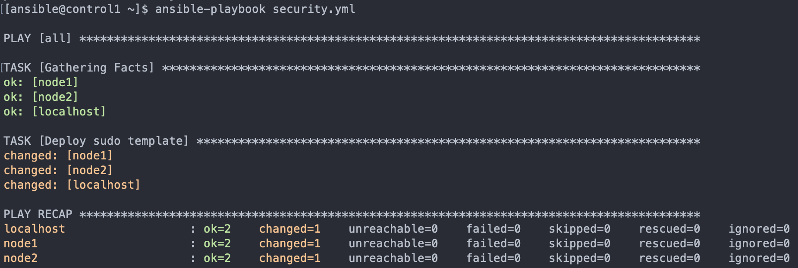

# Learn Ansible by Doing
- **[Installation and Configuration](#installation-and-configuration-1)**
    - [Deploying Ansible](#deploying-ansible)
    - [Getting Started with Ansible](#getting-started-with-ansible)
    - [Ad-Hoc Ansible Commands](#ad-hoc-ansible-commands)
    - [Working with Ansible Inventories](#working-with-ansible-inventories)
- **[Plays and Playbooks](#plays-and-playbooks-1)**
    - [Ansible Playbooks: The Basics](#ansible-playbooks-the-basics)
    - [Ansible Playbooks - Error Handling](#ansible-playbooks---error-handling)
    - [Working with Ansible Templates, Variables, and Facts](#working-with-ansible-templates-variables-and-facts)
    - [Writing Your First Ansible Playbook](#writing-your-first-ansible-playbook)
    - [Deploying Services Using Ansible](#deploying-services-using-ansible)
    - [Advanced Features in Ansible Playbooks](#advanced-features-in-ansible-playbooks)
- **[Roles](#roles-1)**
    - [Working with Ansible Roles](#working-with-ansible-roles)
- **[Working With Files](#working-with-files-1)**
    - [File Manipulation with Ansible](#file-manipulation-with-ansible)
- **[Ansible Vault](#ansible-vault-1)**
    - [Working with Confidential Data in Ansible](#working-with-confidential-data-in-ansible)


<br><br><br><br>
## Installation and Configuration
### Deploying Ansible

- Install Ansible on the control host.
    Run the following commands on the control host:
    ```shell
    sudo yum install epel-release
    sudo yum install ansible
    ```
- Create an `ansible` user on both the control host and workstation host being sure to set a password you can remember.
    On each host, run the noted commands below. Make sure you set a password you can remember (you will need it later).

    Assuming you are logged in as cloud_user:
    ```shell
    sudo useradd ansible
    sudo passwd ansible
    ```
- Configure a pre-shared key for Ansible that allows the user to log in from `control` to `workstation` without a password.
    Assuming you are logged into control as **cloud_user**, run the following commands providing the appropirate passwords when prompted and default options otherwise:
    ```bash
    sudo -i -u ansible # (provide cloud_user a sudo password)
    ssh-keygen # (accept default options by pressing enter)
    ssh-copy-id workstation # (provide ansible user a password)
    logout
    ```
- Configure the Ansible user on the workstation host so that Ansible may sudo without a password.
    Log into the workstation host as cloud_user and run the following commands:
    ```bash
    sudo visudo
    # Add text at the end of the file that is opened:
    ansible ALL=(ALL) NOPASSWD: ALL
    # Save file:
    # (:wq in vim)
    ```

- Create a simple inventory in `/home/ansible/inventory` consisting of only the `workstation` host.

    On the control host as the ansible user run the following commands:
    ```bash
    vim /home/ansible/inventory
    ```
    (note: you may use any text editor with which you are comfortable)
    Add the text "workstation" to the file and save using (`:wq in vim`).

- Write an Ansible playbook in `/home/ansible/git-setup.yml` on the control node that installs `git` on `workstation` then execute the playbook.
    On the control host as the ansible user run the following commands:
    ```bash
    vim /home/ansible/git-setup.yml # (You may use any text editor with which your are comfortable.)
    ```
    Add the following text to the file:
    ```yaml
    --- # install git on target host
    - hosts: workstation
      become: yes
      tasks:
      - name: install git
        yum:
          name: git
          state: latest
    ```
    Save (:wq in vim) and quit the text editor.

    **Run** 
    ```
    ansible-playbook -i /home/ansible/inventory /home/ansible/git-setup.yml
    ```


<br><br><br><br>
### Getting Started with Ansible
-  Install Ansible on the control node.
    To install Ansible on the control node, run 
    ```bash
    sudo yum install ansible
    ```

- Configure the `ansible` user on the control node for ssh shared key access to managed nodes. Do not use a passphrase for the key pair.
    - To create a keypair for the ansible user on the control host, run the following: ```sudo su - ansible```
    - ```ssh-keygen``` (accept all defaults: press enter for each prompt)
    - Copy the public key to both **node1** and **node2**.
    - As the `ansible` user on the control host:
        - `ssh-copy-id node1` (accept the host key if prompted, authenticate as ansible user)
        - `ssh-copy-id node2` (accept the host key if prompted, authenticate as ansible user)

- Create a simple Ansible inventory on the control node in `/home/ansible/inventory` containing `node1` and `node2`.
    - On the control host:
    - `sudo su - ansible` (if not already ansible user)
    - `touch /home/ansible/inventory`
    - `echo "node1" >> /home/ansible/inventory`
    - `echo "node2" >> /home/ansible/inventory`

- Configure sudo access for Ansible on `node1` and `node2` such that Ansible may use sudo for any command with no password prompt.
    - Log in to node1 as cloud_user and edit the sudoers file to contain appropriate access for the ansible user:
        - `ssh cloud_user@node1`
        - `sudo visudo`
        - Add the following line to the file and save:
            ```yaml
            ansible    ALL=(ALL)       NOPASSWD: ALL
            ```
        - Repeate these steps for node2.

- Verify each managed node is able to be accessed by Ansible from the control node using the `ping` module. Redirect the output of a successful command to `/home/ansible/output`.
    - To verify each node, run the following as the ansible user from the control host:
        - `ansible -i /home/ansible/inventory node1 -m ping`
        - `ansible -i /home/ansible/inventory node2 -m ping`

    - To redirect output of a successful command to /home/ansible/output:
        - `ansible -i /home/ansible/inventory node1 -m ping > /home/ansible/output`


<br><br><br><br>
### Ad-Hoc Ansible Commands

To summarize, you must do the following:
- Create the user accounts noted in /home/ansible/userlist.txt.
- Copy the authorized_keys file for each user to the correct location so the new accounts can log in with ssh key authentication.
- Ensure auditd is enabled and running on all systems.


<br><br><br>
- Create the User Accounts Noted in `/home/ansible/userlist.txt`

    ```bash
    ansible dbsystems -b -m user -a "name=consultant"
    ansible dbsystems -b -m user -a "name=supervisor"
    ```

    > `-b` - become
    > `-m` - module
    > `user` -
    > `-a` -

- Place Key Files in the Correct Location, `/home/$USER/.ssh/authorized_keys`, on Hosts in `dbsystems`
    
    - Create directory and add permissions

        ```bash
        ansible dbsystems -b -m file -a "path=/home/consultant/.ssh state=directory owner=consultant group=consultant mode=0755"
        ```
    - 
        ```bash
        ansible dbsystems -b -m copy -a "src=/home/ansible/keys/consultant/authorized_keys dest=/home/consultant/.ssh/authorized_keys mode=0600 owner=consultant group=consultant"
        ```
    - Create directory and add permissions

        ```bash
        ansible dbsystems -b -m file -a "path=/home/supervisor/.ssh state=directory owner=supervisor group=supervisor mode=0755"
        ```

    - 
        ```bash
        ansible dbsystems -b -m copy -a "src=/home/ansible/keys/supervisor/authorized_keys dest=/home/supervisor/.ssh/authorized_keys mode=0600 owner=supervisor group=supervisor"
        ```

- Ensure `auditd` Is Enabled and Running on All Hosts
    ```bash
    ansible all -b -m service -a "name=auditd state=started enabled=yes"
    ```


<br><br><br><br>
### Working with Ansible Inventories

Ansible relies on an inventory for base functionality. While inventories can be very simple, they have been designed to be robust. This exercise walks through how to use some of the more advanced features available within an Ansible inventory. Upon completion of this exercise, students will have practical experience with Ansible inventory configuration.

This course is not approved or sponsored by Red Hat.

#### Additional Resources

Your company decided that their backup software license was frivolous and unnecessary. Because of this, the license was not renewed. As a stopgap measure, your supervisor has created a simple script and an Ansible playbook to create an archive of select files, depending on pre-defined Ansible host groups. You will create the inventory file to complete the backup strategy.

Important notes:
- For your convenience, Ansible has been installed on the control node.
- The user ansible has already been created on all servers with appropriate shared keys for access to managed servers from the control node.
- The ansible user has the same `password` as `cloud_user`.
- `/etc/hosts` entries have been made on `control1` for the managed servers.

<br><br>
**Learning objectives:**

- Create the inventory File in `/home/ansible/`
  - Create the `inventory` file in `/home/ansible/`
    `touch /home/cloud_user/.ansible/inventory`
- Configure the media Host Group to Contain `media1` and `media2`
  - Use an editor, such as **Vim**, to configure the `media` host group to contain `media1` and `media2`
    ```shell
    su ansible
    vim $HOME/inventory
    [media]
    media1
    media2
    ```
- Define Variables for media with Their Accompanying Values
  - Define the following variables for media with their accompanying values:
    - `media_content` should be set to `/tmp/var/media/content/`.
    - `media_index` should be set to `/tmp//opt/media/mediaIndex`.
  
    > Ansible recommended approach is to use separate directory for variables (group_vars) and name the file with the same name as the group variables are applicable to.

    ```shell
    mkdir group_vars
    vim media 
    media_content: /tmp/var/media/content
    media_index: /tmp/opt/media/mediaIndex
    ```


- Configure the webservers Host Group to Contain the Hosts `web1` and `web2`
  - Configure the `webservers` host group to contain the hosts `web1` and `web2`

    ```shell
    vim $HOME/inventory
    [media]
    media1
    media2

    [webservers]
    web1
    web2
    ```

    > `ansible -i inventory -m ping all`

- Define Variables for webservers with Their Accompanying Values
  - Define the following variables for webservers with their accompanying values:
    - `httpd_webroot` should be set to `/var/www/`.
    - `httpd_config` should be set to `/etc/httpd/`.

    ```shell
    cd group_vars
    vim webservers 
    httpd_webroot: /var/www/
    httpd_config: /etc/httpd/
    ```

- Define the `script_files` Variable for `web1` and Set Its Value to `/usr/local/scripts`
    1. Define the variable `script_files` specifically for `web1`. The value of `script_files` should be set to `/tmp/usr/local/scripts`.
    2. To test your inventory, run `/home/ansible/scripts/backup.sh`.
        If you have correctly configured the inventory, it should not error.

        Note: Do not edit anything in `/home/ansible/scripts/`.

    ```shell
    mkdir $HOME/.ansible/host_vars
    cd host_vars
    vim web1
    script_files: /tmp/usr/local/scripts
    ```

- Run backup.sh script to confirm that everything is working.

    backup.sh
    ```bash
    #!/bin/sh

    # Need to take a tag varialbe
    # mediavars to test media
    # webservervars to test webservers
    # hostvar to test host var
    # use playbook tags maybe?

    case "$1" in
    mediavars)
        ansible-playbook -i /home/ansible/inventory /home/ansible/scripts/backup.yml --tags "mediavars"
        exit $?
        ;;
    webservervars)
        ansible-playbook -i /home/ansible/inventory /home/ansible/scripts/backup.yml --tags "webservervars"
        exit $?
        ;;
    hostvar)
        ansible-playbook -i /home/ansible/inventory /home/ansible/scripts/backup.yml --tags "hostvar"
        exit $?
        ;;
    *)
        ansible-playbook -i /home/ansible/inventory /home/ansible/scripts/backup.yml
        exit $?
    esac
    ```
    backup.yml
    ```
    ---
    - hosts: all
    become: yes
    tasks:
        - name: create backup directories
        file:
            path: /mnt/backup_vol/{{ ansible_hostname }}
            state: directory
        tags:
            - hostvar
            - webservervars
            - mediavars
    - hosts: web1
    become: yes
    tasks:
        - name: backup scripts
        archive:
            dest: /mnt/backup_vol/{{ ansible_hostname }}/scripts.tgz
            path: "{{ script_files }}"
        tags: hostvar

    - hosts: webservers
    become: yes
    tasks:
        - name: backup httpd configs
        archive:
            dest: /mnt/backup_vol/{{ ansible_hostname }}/httpd_configs.tgz
            path: "{{ httpd_config }}"
        tags: webservervars
        - name: backup webroot
        archive:
            dest: /mnt/backup_vol/{{ ansible_hostname }}/httpd_webroot.tgz
            path: "{{ httpd_webroot }}"
        tags: webservervars

    - hosts: media
    become: yes
    tasks:
        - name: backup media content
        archive:
            dest: /mnt/backup_vol/{{ ansible_hostname }}/media_content.tgz
            path: "{{ media_content }}"
        tags: mediavars
        - name: backup media index
        archive:
            dest: /mnt/backup_vol/{{ ansible_hostname }}/media_index.tgz
            path: "{{ media_index }}"
        tags: mediavars
    ```

<br><br><br><br>
## Plays and Playbooks
### Ansible Playbooks: The Basics

<br>

**ABOUT THIS LAB**

    The playbook concept is at the heart of Ansible. Writing a playbook to configure a system to the desired state is what makes this exercise so valuable to students who are wanting to get serious with Ansible. After completing this learning activity on how to configure an inventory all the way through to a mass software deployment, students will be another step closer to an official Red Hat Ansible certification.

<br>

**Additional Resources**

Your company has been increasing the deployment of small broacher-style websites for clients. The head of IT has decided that each client should have their own web servers for better client isolation and has tasked you with creating concept automation to quickly deploy web-nodes with simple static website content.

You have been provided an ansible control node and 2 test lab servers (node1 and node2) that have been preconfigured with the ansible user and key.

You must create an ansible inventory in /home/ansible/inventory containing a host group named web. The web group should contain node1 and node2.

Furthermore, you must design an Ansible playbook that will execute the following tasks on your configured inventory: install httpd, start and enable the httpd service, and install a simple website provided on a repo server. Create the playbook in /home/ansible/web.yml. The simple website may be accessed from http://repo.example.com/website.tgz.

Note: Please wait an extra minute before starting the lab to make sure it is fully provisioned.

<br>

**Summary tasks list**:
- Create an inventory in `/home/ansible/inventory` containing a host group named web. The web group should contain `node1` and `node2`.
- Create a playbook in `/home/ansible/web.yml`.
- Configure the playbook to **install httpd on the web group**.
- Configure the playbook to **start and enable the httpd service on the web group**.
- Configure the playbook to **retrieve the website from http://repo.example.com/website.tgz on each server in the web group**.
- Configure the playbook to **unarchive the website into /var/www/html on all servers in the web group**.
- Execute the playbook you created using the inventory you created to verify your work.
  
**Important notes**:

- For your convenience, Ansible has been installed on the control node.
- The user ansible is present on all servers with appropriate shared keys for access to managed servers from the control node.
- The ansible user has the same password as cloud_user.
/etc/hosts entries have been made on control1 for the managed servers.


<br>

**Learning Objectives**

- Create an Inventory in `/home/ansible/inventory `That Contains a Host Group Named `web`. The `web` Group Should Contain `node1` and `node2`
    - `echo "[web]" >> /home/ansible/inventory`
    - `echo "node1" >> /home/ansible/inventory`
    - `echo "node2" >> /home/ansible/inventory`


- Create a Playbook in `/home/ansible/web.yml`
    - `echo "---" >> /home/ansible/web.yml

- Configure the Playbook to Install `httpd` on the `web` Group
    
    ```yaml
    ---
    - hosts: web
        become: yes
        tasks:
        - name: Install httpd
            yum: name=httpd state=latest

    ```

- Configure the Playbook to Start and Enable the `httpd` Service on the `web` Group

    ```yaml
    ---
    - hosts: web
    become: yes
    tasks:
        - name: Install httpd
        yum: name=httpd state=latest
        - name: Start and enable
        service: name=httpd state=started enabled=yes
    ```

- Configure the Playbook to Retrieve the Website from *http://repo.example.com/website.tgz* on Each Server in the `web` Group
    ```yaml
    ---
    - hosts: web
    become: yes
    tasks:
        - name: Install httpd
        yum: name=httpd state=latest
        - name: Start and enable
        service: name=httpd state=started enabled=yes
        - name: Retrieve website from repo
        get_url: url=http://repo.example.com/website.tgz dest=/tmp/website.tgz
    ```

- Configure the Playbook to Unarchive the Website into `/var/www/html` on All Servers in the `web` Group
    ```yaml
    ---
    - hosts: web
    become: yes
    tasks:
        - name: Install httpd
        yum: name=httpd state=latest
        - name: Start and enable
        service: name=httpd state=started enabled=yes
        - name: Retrieve website from repo
        get_url: url=http://repo.example.com/website.tgz dest=/tmp/website.tgz
        - name: Install website
        unarchive: remote_src=yes src=/tmp/website.tgz dest=/var/www/html/
    ```


- Verify the Work by Executing the Playbook Using the Inventory

    `ansible-playbook -i /home/ansible/inventory /home/ansible/web.yml`

    Expected output:
    

    Validate the upload:
    `curl node1/home.html`


<br><br><br><br>
### Ansible Playbooks - Error Handling


Advanced error handling is one of the many strengths of Ansible. Software systems are seldom perfect, and that is an issue in this exercise. Students must configure an Ansible playbook to handle an unreliable connection. This skill is not only essential for practical Ansible use, but also an objective on the Red Hat Certified Ansible Specialist Exam.

<br>

**Additional Resources**

We have to set up automation to pull down a data file, from a notoriously unreliable third-party system, for integration purposes. Create a playbook that attempts to pull down `http://apps.l33t.com/transaction_list` to `localhost`. The playbook should gracefully handle the site being down by outputting the message `"l33t.com appears to be down. Try again later."` to stdout. If the task succeeds, the playbook should write `"File downloaded."` to `stdout`. No matter if the playbook errors or not, it should always output `"Attempt completed."` to `stdout`.

If the report is collected, the playbook should write and edit the file to replace all occurrences of `#BLANKLINE` with a line break `\n`.

<br>

**Learning Objectives**
- Create a playbook: `/home/ansible/report.yml`

    `echo "---" >> /home/ansible/report.yml`

- Configure the Playbook to Download *http://apps.l33t.com/transaction_list* to `/home/ansible/transaction_list` on `localhost` and Outputs the Message "File downloaded." to `stdout`

    ```yaml
    - hosts: localhost
        tasks:
        - name: download transaction_list
            get_url:
            url: http://apps.l33t.com/transaction_list 
            dest: /home/ansible/transaction_list
        - debug: msg="File downloaded"
    ```


- Configure the Playbook to Handle Connection Failure by Outputting "l33t.com appears to be down. Try again later." to `stdout`

    Using a text editor, such as `vim`, edit the tasks section in `/home/ansible/report.yml` to contain the new lines as shown below. Note that the `get_url` line was changed to include a leading hyphen:

    ```yaml
    ---
    - hosts: localhost
    tasks:
        - name: download transaction_list
        block:
            - get_url:
                url: http://apps.l33t.com/transaction_list
                dest: /home/ansible/transaction_list
            - debug: msg="File downloaded"
        rescue:
            - debug: msg="l33t.com appears to be down.  Try again later."
    ```

- Configure the Playbook to Output "Attempt Completed" to `stdout`, Whether It Was Successful or Not

    Using a text editor, such as `vim`, edit the tasks section in `/home/ansible/report.yml` to contain the new lines as shown below.

    ```yaml
    ---
    - hosts: localhost
    tasks:
        - name: download transaction_list
        block:
            - get_url:
                url: http://apps.l33t.com/transaction_list
                dest: /home/ansible/transaction_list
            - debug: msg="File downloaded"
        rescue:
            - debug: msg="l33t.com appears to be down.  Try again later."
        always:
            - debug: msg="Attempt completed."
    ```

- Configure the Playbook to Replace All Instances of `#BLANKLINE` with the Line Break Character `\n`

    ```yaml
    ---
    - hosts: localhost
    tasks:
        - name: download transaction_list
        block:
            - get_url:
                url: http://apps.l33t.com/transaction_list
                dest: /home/ansible/transaction_list
            - replace: 
                path: /home/ansible/transaction_list 
                regexp: "#BLANKLINE"
                replace: '\n'
            - debug: msg="File downloaded"
        rescue:
            - debug: msg="l33t.com appears to be down.  Try again later."
        always:
            - debug: msg="Attempt completed."
    ```


- Verify Configuration by Running the Playbook

    `ansible-playbook /home/ansible/report.yml`

    Expected output:

    


<br><br><br><br>
### Working with Ansible Templates, Variables, and Facts

**ABOUT THIS LAB**

Besides being an objective on the Red Hat Certified Ansible Specialist Exam, a demonstrated ability to use Ansible templates, variables, and facts is essential to practical systems deployment through Ansible. Templates allow for a streamlined approach to configuration management that reduces configuration error and simplifies system upkeep. This learning activity starts a student on a path from basic Ansible knowledge to a strong working knowledge that is necessary for real-world application.

<br>

**Additional information**

A colleague of yours was the unfortunate victim of a scam email, and their network account was compromised. Shortly after you finished helping them pack up their desk, your boss gave you the assignment to promote system security through deploying a hardened sudoers file. You will need to create an Ansible template of the sudoers file that meets the following criteria:

  - A file named `/etc/sudoers.d/hardened` to deploy on all ansible inventory servers. WARNING: **Do NOT edit the default `sudoers` file**, doing so may break your exercise environment. 
   
    Additionally, always validate any file placed in /etc/sudoers.d with `/sbin/visudo -cf <filename>` prior to deployment!!
  - Grant users in the `sysops` group the ability to run all commands as root for each local system by IP address. This would be what the entry in your result file except with the target system's IP: `%sysops 34.124.22.55 = (ALL) ALL`.
  - Define the `host_alias` group `WEBSERVERS` to contain all servers in the ansible web inventory group: `Host_Alias WEBSERVERS = <host name>`.
  - Define the `host_alias` group `DBSERVERS` to contain all servers in the ansible database inventory group: `Host_Alias DBSERVERS = <host name>`
  - Grant users in the `httpd` group the ability to `sudo su - webuser` on the WEBSERVERS hosts: `%httpd WEBSERVERS = /bin/su - webuser`
  - Grant users in the `dba` group `sudo su - dbuser` on the DBSERVERS hosts: `%dba DBSERVERS = /bin/su - dbuser`
  - The file must be validated using `/sbin/visudo -cf` before deployment.

You will need to create an accompanying playbook in `/home/ansible/security.yml` that will deploy this template to all servers in the default inventory.

<br>

**Learning Objectives**

- Create a Template *sudoers* File in `/home/ansible/hardened.j2` That Produces a File with Appropriate Output for Each Host

    `touch /home/ansible/hardened.j2`


- The Deployed File Should Resemble the Example File Except with the *IP* and *hostnames* Customized Appropriately

    Edit hardened.j2 to contain the following text:
    ```yaml
    %sysops {{ ansible_default_ipv4.address }} = (ALL) ALL
    Host_Alias WEBSERVERS = {{ groups['web']|join(', ') }}
    Host_Alias DBSERVERS = {{ groups['database']|join(', ') }} 
    %httpd WEBSERVERS = /bin/su - webuser
    %dba DBSERVERS = /bin/su - dbuser
    ```


- Create a Playbook in `/home/ansible/security.yml` That Uses the Template Module to Deploy the Template on All Servers in the Default Ansible Inventory After Validating the Syntax of the Generated File

    Edit `/home/ansible/security.yml` to contain the following:
    ```yaml
    ---
    - hosts: all
      become: yes
      tasks:
      - name: deploy sudo template
          template:
          src: /home/ansible/hardened.j2
          dest: /etc/sudoers.d/hardened
          validate: /sbin/visudo -cf %s
    ```
- Run the Playbook and Ensure the Files Are Correctly Deployed

    `ansible-playbook /home/ansible/security.yml`

    Check the local /etc/sudoers.d/hardened on the ansible control node for the correct contents.

    Expected outcome:
    

    Check file creation on the local host:
    ```shell
    sudo su - 
    cat /etc/sudoers.d/hardened
    ```


<br><br><br><br>
### Writing Your First Ansible Playbook

**ABOUT THIS LAB**

Playbooks are the heart of Ansible. They provide a means of executing numerous tasks across any number of systems. This exercise sets you on the path to Ansible mastery by allowing you to craft and execute an Ansible playbook.

**Additional Resources**

Your supervisor has asked you to find a way to automate and audit basic system configuration for new servers in your environment. Given that Ansible is already configured at a basic level in your environment, the simplest solution would be to just write a playbook for bootstrapping your new hosts. Create a playbook called /home/ansible/bootstrap.yml to fulfill the following boot strap requirements:

**All servers**:
- Edit `/etc/hosts` to include the following entry: `ansible.xyzcorp.com 169.168.0.1`
- Install `elinks`
- Create the user `xyzcorp_audit`
- Copy the files `/home/ansible/motd` and `/home/ansible/issue` to `/etc/`

**Network servers**:
- Install `nmap-ncat`
- Create the user `xyzcorp_network`

**SysAdmin servers**:
- Copy `/home/ansible/scripts.tgz` from the control node to `/mnt/storage`

<br>

**Learning Objectives**

- Create a Basic Playbook for All Servers in the Ansible Inventory

  Create the file `/home/ansible/bootstrap.yml` and add the following content:

    ```yaml
    ---
    - hosts: all
    become: yes
    tasks:
        - name: edit host file
        lineinfile:
            path: /etc/hosts
            line: "ansible.xyzcorp.com 169.168.0.1"

        - name: install elinks
        package:
            name: elinks
            state: latest

        - name: create audit user
        user:
            name: xyzcorp_audit
            state: present

        - name: update motd
        copy:
            src: /home/ansible/motd
            dest: /etc/motd

        - name: update issue
        copy:
            src: /home/ansible/issue
            dest: /etc/issue
    ```

- Add a Section to the Playbook for the Network Servers in the Ansible Inventory

    Add a section to the playbook in `/home/ansible/bootstrap.yml` that completes the noted task required for the network servers in the Ansible inventory.
    ```yaml
    - hosts: network
      become: yes
      tasks:
        - name: install netcat
          yum:
            name: nmap-ncat
            state: latest
        - name: create network user
          user:
            name: xyzcorp_network
            state: present
    ```


- Add a Section to the Playbook for the SysAdmin Servers in the Ansible Inventory

    Add a section to the playbook in `/home/ansible/bootstrap.yml` that completes the noted task required for the `sysadmin` servers in the Ansible inventory.

    ```yaml
    - hosts: sysadmin
      become: yes
      tasks:
        - name: copy tarball
          copy:
            src: /home/ansible/scripts.tgz
            dest: /mnt/storage/
    ```

- Execute Playbook to Verify Your Playbook Works Correctly

    Execute playbook `/home/ansible/bootstrap.yml` to verify your playbook works correctly.

    Run `ansible-playbook /home/ansible/bootstrap.yml` from the control node.

    expected output:
    

<br><br><br><br>
### Deploying Services Using Ansible

**ABOUT THIS LAB**

Ansible is frequently used to manage software configuration and deployment. This exercise allows students to deploy and configure an NFS server using key features of Ansible.

<br>

**Additional Resources**

The team has been working on automating the builds for common services using Ansible. You have been tasked with creating the build for a common NFS server. Write a playbook that satisfies the following requirements:

On `nfs`:
- Make sure `nfs-utils` is installed.
- Configure `/etc/exports` via an Ansible template stored in `/home/ansible/exports.j2`. Deploy the template so that `/mnt/nfsroot` is exported with read and write to all hosts.
  - **Note**: Your template file should contain the following with the variable `{{ share_path }}` being defined within your playbook:
    `{{ share_path }} *(rw)`
  - **Note**: The file `/etc/exports` on `nfs` should have the following content once deployed:
    `/mnt/nfsroot *(rw)`
- Create a handler that runs the command `exportfs -a` if the file `/etc/exports` is modified in a playbook task.
- You can assume all necessary firewall rules have been deployed.
  
On `remote`:
- Configure `/etc/hosts` from a template file stored on control at `/home/ansible/etc.hosts.j2` with the following entries:
  - 
    ```yaml 
    127.0.0.1 localhost {{ ansible_hostname }}
    {{ nfs_ip }}  {{ nfs_hostname }}
    ```
  - **Note**: You should populate the variables `{{ nfs_ip }}` and `{{ nfs_hostname }}` using magic variables in your playbook.
  - Create users from file stored on control at `/home/ansible/user-list.txt` only if the remote host has the file `/opt/user-agreement.txt`.

<br>

**Learning Objectives**
- Create the necessary template files on the Ansible control node.

    Create the files `exports.j2` and `etc.hosts.j2` in `/home/ansible` with the noted content:

    exports.j2
    ```yaml
    {{ share_path }} *(rw)
    ```
    <br>

    etc.hosts.j2
    ```yaml
    127.0.0.1	localhost {{ ansible_hostname}}
    {{ nfs_ip }}	{{ nfs_hostname }}
    ```


- Create a playbook for the server 'nfs' in the Ansible inventory.

    Create a playbook in `/home/ansible/nfs.yml` that meets the provided specification for the server nfs in the ansible inventory:

    ```yaml
    - hosts: nfs 
      become: yes
      vars: 
        share_path: /mnt/nfsroot 
      tasks: 
        - name: install nfs
          yum: 
            name: nfs-utils 
            state: latest
        - name: start and enable nfs-server 
          service: 
            name: nfs-server 
            state: started 
            enabled: yes 
        - name: configure exports 
          template: 
            src: /home/ansible/exports.j2 
            dest: /etc/exports 
          notify: update nfs  #Notify handler below
      handlers: 
        - name: update nfs exports 
          command: exportfs -a 
          listen: update nfs
    ```


- Add a play for the remote host group.

    Edit /home/ansible/nfs.yml to contain the following content after the nfs play: 
    ```yaml    
    - hosts: remote
      become: yes
      vars:
        nfs_ip: "{{ hostvars['nfs']['ansible_default_ipv4']['address'] }}" nfs_hostname: "{{ hostvars['nfs']['ansible_hostname'] }}" 
      vars_files: 
        - /home/ansible/user-list.txt 
    
      tasks: 
        - name: configure hostsfile 
          template: 
            src: /home/ansible/etc.hosts.j2
            dest: /etc/hosts.nfslab 
        - name: get file status 
          stat: 
            path: /opt/user-agreement.txt 
          register: filestat #user in when condition below
        - name: debug info 
          debug: 
            var: filestat 
        - name: create users  # CONDITIONAL TASKS
          user: 
            name: "{{ item }}" 
          when: filestat.stat.exists # Check if the file exists in condition above
          loop: "{{ users }}"
    ```

- Execute playbook to verify your playbook works correctly.

    Run `ansible-playbook /home/ansible/nfs.yml` from the control node.

    Expected outcome:
    


    Review host:
    ```shell
    ssh nfs
    cat /etc/exports
    systemctl status nfs-server
    exit

    ssh node2
    cat /etc/hosts
    id judy
    ```
    


<br><br><br><br>
### Advanced Features in Ansible Playbooks

**ABOUT THIS LAB**

There are a number of features unique to Ansible playbooks which provide robust functionality. This exercise explores many of these features in a practical scenario of deploying a web server. Most notably, this exercise deals with confidential data in an Ansible vault and working with tags in Ansible playbooks.

<br>

**Additional Resources**

You must create a modular playbook used for webserver management. Create a playbook called /home/ansible/webserver.yml that meets the following requirements:

**On the host group `webservers`:**
- Deploy `httpd`.
- You can assume all necessary firewall rules have been deployed.
- Start and enable `httpd`.
- Configure virtual host using the provided templates in `/home/ansible/vhost.conf.j2` and `/home/ansible/htpasswd.j2`.
    - **Note**: The template references a variable defined in `/home/ansible/confidential` which must be included as a variable file in your playbook.
    - Use ansible vault to secure `/home/ansible/confidential` with password "`I love ansible`".
- Run the data job stored in `/opt/data-job.sh` on each node in webservers asynchronously, without polling for status.
- Create tags for the following tasks:
    - `base-install` for `httpd` installation and service configuration.
    - `vhost` for virtual host deployment.
    - `data-job` to execute the asynchronous data job.


<br>

**Learning Objectives**

- Use ansible-vault to protect the confidential information.

    Use `ansible-vault` to encrypt `/home/ansible/confidential` to protect the confidential information stored within using the password "I love ansible".

    Run 
    ```shell
    ansible-vault encrypt /home/ansible/confidential
    ```
    and supply the password "**I love ansible**".


- Create a playbook that deploys httpd on webservers.

    Create a playbook in `/home/ansible/webserver.yml` that deploys httpd on webservers.

    ```yaml
      - hosts: webservers
        become: yes
        vars_files:
          - /home/ansible/confidential
        tasks:
          - name: install httpd
            yum:
              name: httpd
              state: latest
            notify: httpd service
            tags:
              - base-install
        handlers:
        - name: Restart and enable httpd
            service:
                name: httpd
                state: restarted
                enabled: yes
            listen: httpd service
    ```


- Deploy the templates stored on the control node to the webservers group.

    Configure `/home/ansible/webserver.yml` to deploy the templates `/home/ansible/vhost.conf.j2` and `/home/ansible/htpasswd.j2` stored on the control node to the `webservers` group. `httpd` must restart on config change. The tasks should be tagged `vhost`.

    ```yaml
    - name: configure virtual host
      template:
        src: /home/ansible/vhost.conf.j2
        dest: /etc/httpd/conf.d/vhost.conf
      notify: httpd service
      tags:
        - vhost
    - name: configure site auth
      template:
        src: /home/ansible/htpasswd.j2
        dest: /etc/httpd/conf/htpasswd
      notify: httpd service
      tags:
        - vhost
    ```


- Asynchronously execute data-job on webservers.

    Configure `/home/ansible/webserver.yml` to **asynchronously** execute `/opt/data-job.sh` located on webservers with a timeout of **600 seconds and no polling**. The task should be tagged with `data-job`.

    Add the following text to `/home/ansible/webserver.yml` just before the `handler` section:
    
    ```yaml
    - name: run data job 
      command: /opt/data-job.sh 
      async: 600 
      poll: 0 
      tags: 
        - data-job
    ```


- Execute playbook to verify your playbook works correctly.

    Execute playbook `/home/ansible/webserver.yml` to verify your playbook works correctly.

    Run `ansible-playbook --ask-vault-pass /home/ansible/webserver.yml` from the control node providing the vault password "`I love ansible`".

    <br>

    You can also run jobs with specific tags only:
    `ansible-playbook webserver.yml --ask-vault-pass --tags base-install`

    <br><br>

    Confirm changes:

    - curl the host1:
  
        `curl host1`


        ```html
        <! DOCTYPE HTML PUBLIC "-//IETF//DTD HTML 2.0//EN">
        chtml><head>
        «title>401 Unauthorized</title>
        </head><body>
        <h1>Unauthorized</h1>
        <p> This server could not verify that you are authorized to access the document requested.
        Either you supplied the wrong credentials (e.g., bad password), or your browser doesn't understand how to supply the credentials required.</p>
        </body></html>
        ```

    - login into host1 and check `ps` for running script:
       ```shell
       ssh host1
       ps -ef | grep data
       ```

       ```shell
       root  1689 0 11:40 00:00:00 [xfs-data/xvdal]
       root 14490 14489 0 12:32 7 00:00:00 /bin/sh/opt/data-job.sh
       ```

<br><br><br><br>
## Roles
### Working with Ansible Roles

**ABOUT THIS LAB**

Working with Ansible roles is a key concept covered on the Red Hat Certified Ansible Specialist Exam (EX407). This should not be a surprise, considering how much functionality roles provide. This exercise covers how to create a role and how to use roles within a playbook. In order to complete this exercise, you will need to have basic proficiency with several common Ansible modules and using Ansible playbooks. After completing this learning activity, you will better understand how to work with Ansible roles.

<br>

**Additional Resources**

You have just started a new job as the operations lead at a small company. There is currently no formal server baseline, and it makes for a mixed configuration environment that is consuming more support and maintenance than it should. You have decided to create a baseline process using Ansible by creating a baseline role. You have noted the following commonalities that should be included in the baseline role:
- Set /etc/motd based on a template.
- Install the latest Nagios client.
- Add the Nagios server to /etc/hosts.
- Create a noc user.
- Import the noc user's public key (copy authorized keys to /home/noc/.ssh/authorized_keys).

The role should be called "baseline" and should reside in /etc/ansible/roles on the ansible control node.

You will test your role on some newly requested webservers. A playbook called web.yml has been provided for you and deploys httpd to all servers in the web group (defined in your default inventory). You will need to edit the playbook to deploy the baseline role to the servers in the web group as well.

You will find the motd template, Nagios server IP information, the noc user's public key, and the web.yml playbook in /home/ansible/resources on the ansible control node.

**Summary tasks list:**
- Create the necessary directories and files for the baseline role.
- Configure the role to deploy the /etc/motd template.
- Configure the role to install the latest Nagios client.
- Configure the role to add an entry to /etc/hosts for the Nagios server.
- Configure the role to create the noc user and deploy the provided public key for the noc user on target systems (copy authorized_keys to /home/noc/.ssh/authorized_keys with the owner and group owner set as noc and the mode as 0600).
- Edit web.yml to deploy the baseline role in addition to what it already does.
- Verify that your role works by deploying web.yml with Ansible.


<br><br><br><br>
## Working With Files
### File Manipulation with Ansible


<br><br><br><br>
## Ansible Vault
### Working with Confidential Data in Ansible


<br><br><br><br>
## Build custom module

1. Create a playbook to call your new module with **hello_world.yml**

    ```yaml
    ---
    - hosts: localhost
    tasks:
        - name: Run Hello world module
        hello_world:
        register: result

        - debug: var=result
    ```

2. Create `library` directory with `.py` file
    - `mkdir library && cd library`
    - Use `#!/usr/bin/python`
    - Import the `ansible.module_utils.basic` to use `AnsibleModule`
    - Use `main()`
    - `AnsibleModule` is used for passing parameters in and out of the module and in this case, only passing back meta with the value of `theReturnValue`

    ```python
    #!/usr/bin/python

    from ansible.module_utils.basic import *

    def main():
        module = AnsibleModule(argument_spec={})
        theReturnValue = {"hello": "world"}
        module.exit_json(changed=False, meta=theReturnValue)

    if __name__ == '__main__':
        main()
    ```

3. Execute playbook
   
   `ansible-playbook hello_world.yml`

   Expected outcome:
    ```shell
    ok:[localhost] => {
        "result": {
            "changed": false,
            "failed": false,
            "meta": {
                "hello": "world"
            }
        }
    }
    ```